# 🏗️ System Architecture Documentation

This document provides a comprehensive overview of the MentorAI system architecture, including component interactions, data flow, and technical design decisions.

## 📋 Table of Contents

1. [System Overview](#system-overview)
2. [Architecture Layers](#architecture-layers)
3. [Component Interactions](#component-interactions)
4. [Database Schema](#database-schema)
5. [AI/ML Pipeline](#aiml-pipeline)
6. [Security Architecture](#security-architecture)
7. [Deployment Architecture](#deployment-architecture)

## 🎯 System Overview

MentorAI is a Django-based intelligent learning assistant that combines traditional web application architecture with modern AI capabilities. The system uses an agent-based approach to coordinate multiple AI tools and provide personalized educational experiences.

### High-Level Architecture

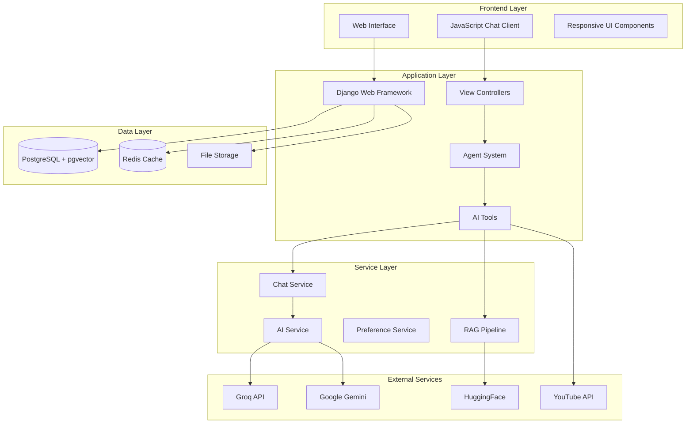

## 🏛️ Architecture Layers

### 1. Presentation Layer

**Technologies:** HTML5, CSS3 (Tailwind), Vanilla JavaScript, Server-Sent Events (SSE)

**Components:**
- `chat.html` - Main chat interface
- `chat.js` - Client-side chat logic
- `stream_handler.js` - Real-time message streaming
- Responsive design with mobile support

**Key Features:**
- Real-time streaming responses
- Dynamic content rendering (diagrams, quizzes, videos)
- File upload interface
- Interactive quiz components

### 2. Application Layer

**Framework:** Django 5.2+ with async support

**Core Components:**

#### Views & Controllers
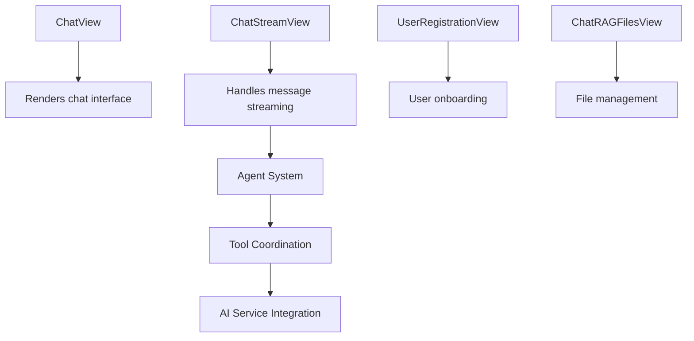

#### Agent System Architecture
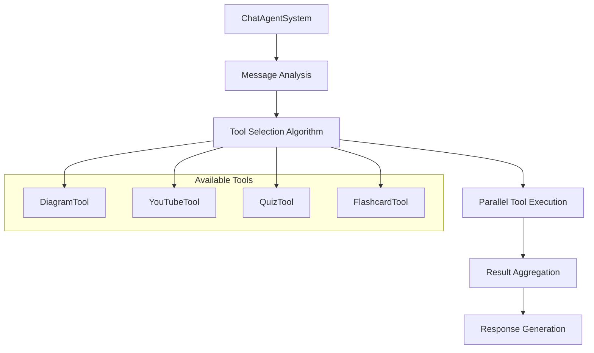

### 3. Service Layer

#### Chat Service (`ChatService`)
- Message processing and storage
- AI model integration
- Tool result coordination
- Context management

#### AI Service (`AIService`)
- Multi-model AI integration (Groq, Gemini)
- Response streaming
- Model selection logic
- Rate limiting and error handling

#### RAG Pipeline (`RAG_pipeline`)
- Document processing (PDF, TXT)
- Vector embedding generation
- Semantic search implementation
- PostgreSQL vector storage

#### Preference Service (`PreferenceService`)
- User preference management
- System prompt generation
- Learning style adaptation

### 4. Data Layer

#### PostgreSQL Database with pgvector Extension

**Key Features:**
- Vector similarity search for RAG
- ACID compliance for data integrity
- JSON field support for flexible schemas
- UUID primary keys for scalability

#### Redis Cache (Optional)
- Session storage
- Temporary data caching
- Rate limiting counters

## 🔄 Component Interactions

### Message Processing Flow

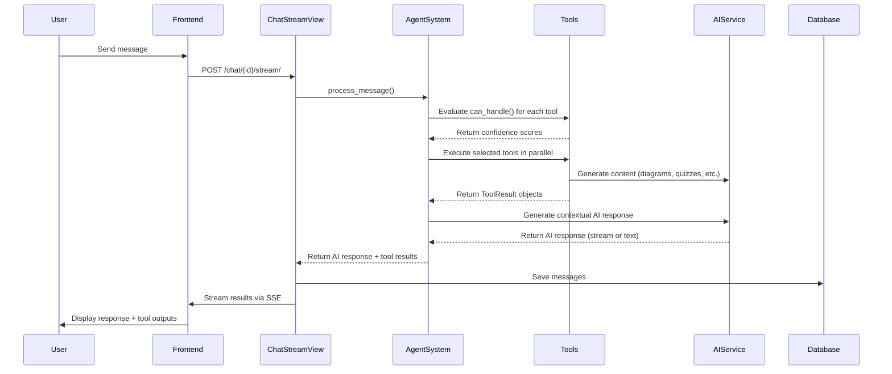

### RAG Document Processing

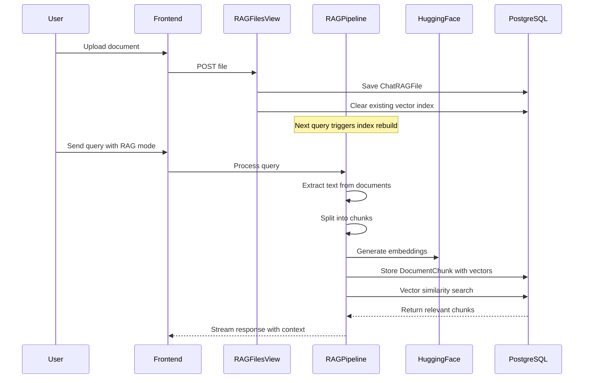

## 🗄️ Database Schema

### Core Models

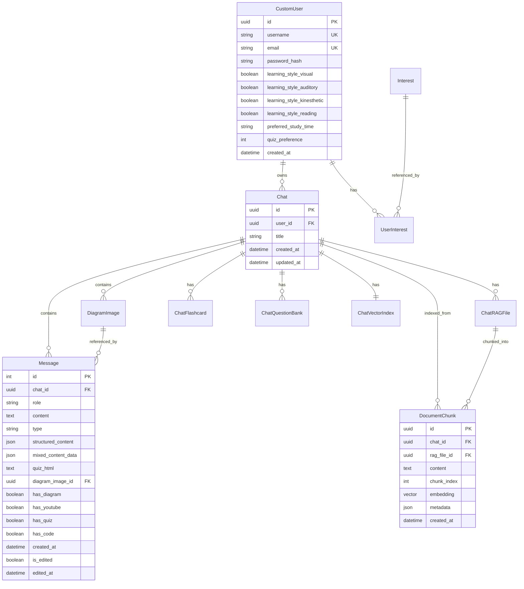

### Key Relationships

1. **User → Chat (1:N)**: Users can have multiple chats
2. **Chat → Message (1:N)**: Each chat contains multiple messages
3. **User → Interest (N:N)**: Users can have multiple interests through UserInterest
4. **Chat → RAG Files (1:N)**: Each chat can have multiple uploaded documents
5. **RAG File → Document Chunks (1:N)**: Files are split into searchable chunks
6. **Chat → Vector Index (1:1)**: Each chat has one vector index for RAG

## 🤖 AI/ML Pipeline

### Multi-Model AI Integration

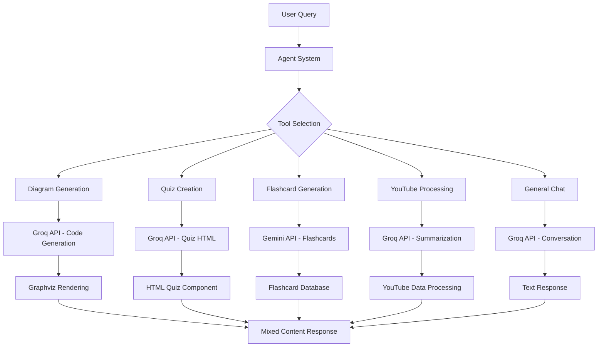

### RAG (Retrieval-Augmented Generation) Pipeline

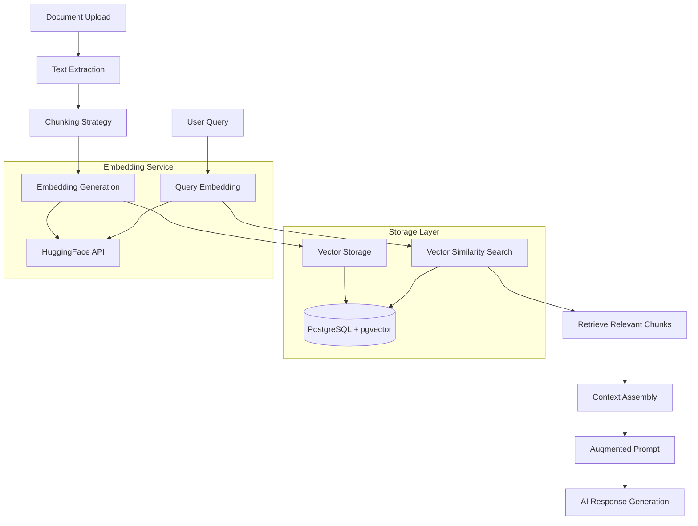

### Tool Confidence Scoring Algorithm

Each tool implements a `can_handle()` method that returns a confidence score (0.0-1.0):

```python
# Example confidence calculation
def can_handle(self, user_message: str, chat_context: Dict[str, Any]) -> float:
    message_lower = user_message.lower()
    
    # High confidence patterns (0.9)
    if re.search(r"(create|make|generate)\s+(a\s+)?(diagram|chart)", message_lower):
        return 0.9
    
    # Medium confidence keywords (0.6)
    if any(trigger in message_lower for trigger in self.triggers):
        return 0.6
    
    # Context-based scoring (0.3)
    if self._has_relevant_context(chat_context):
        return 0.3
    
    return 0.0
```

## 🔒 Security Architecture

### Authentication & Authorization

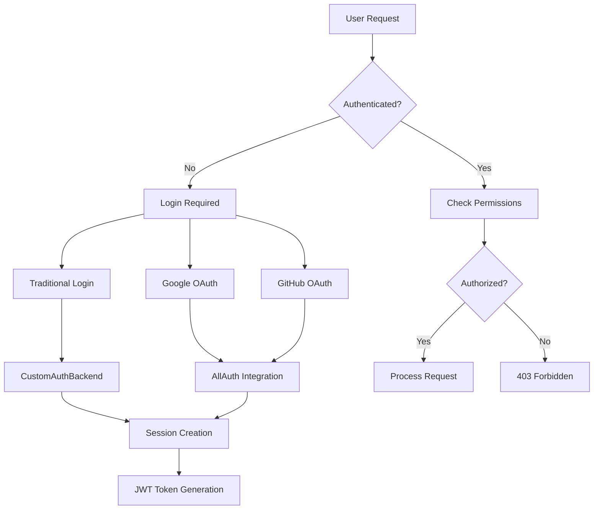

### Data Security Measures

1. **Input Sanitization**: All user inputs are sanitized to prevent XSS/injection attacks
2. **CSRF Protection**: Django's built-in CSRF protection for all forms
3. **SQL Injection Prevention**: Django ORM parameterized queries
4. **File Upload Security**: Type validation and secure storage paths
5. **API Rate Limiting**: Protection against abuse of external APIs
6. **Secure Headers**: Security-focused HTTP headers implementation

### Privacy & Data Protection

- User chat data is isolated per user account
- RAG files are stored in user-specific directories
- Vector embeddings are associated with specific chats
- User preferences are encrypted in database
- Optional data retention policies

## 🚀 Deployment Architecture

### Production Environment

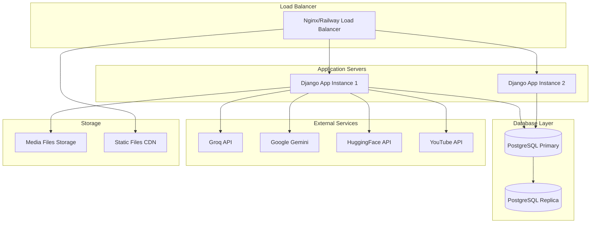

### Scalability Considerations

1. **Horizontal Scaling**: Multiple Django app instances behind load balancer
2. **Database Scaling**: Read replicas for query optimization
3. **Caching Strategy**: Redis for session and query caching
4. **CDN Integration**: Static file delivery optimization
5. **Async Processing**: Background tasks for heavy operations
6. **API Rate Limiting**: Intelligent request throttling

### Monitoring & Observability

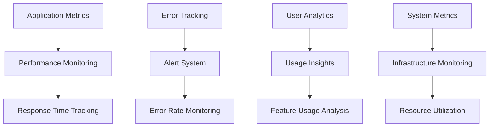

## 🔧 Technology Stack Summary

| Layer | Technologies |
|-------|-------------|
| **Frontend** | HTML5, CSS3 (Tailwind), Vanilla JavaScript, SSE |
| **Backend** | Django 5.2+, Python 3.11+, Async Support |
| **Database** | PostgreSQL 13+ with pgvector extension |
| **Caching** | Redis (optional) |
| **AI/ML** | Groq API, Google Gemini, HuggingFace Transformers |
| **File Processing** | PyPDF2, pdfminer, yt-dlp |
| **Visualization** | Graphviz, Matplotlib |
| **Authentication** | Django AllAuth, OAuth 2.0 |
| **Deployment** | Railway, Docker, Nginx |
| **Monitoring** | Django Logging, Error Tracking |

This architecture provides a robust, scalable foundation for the MentorAI learning assistant while maintaining flexibility for future enhancements and integrations.
