# 🗺️ User Flows Documentation

This document outlines the key user journeys and interactions within the MentorAI application.

## 📋 Table of Contents

1. [Registration & Onboarding Flow](#registration--onboarding-flow)
2. [Chat Interaction Flow](#chat-interaction-flow)
3. [Tool Usage Flows](#tool-usage-flows)
4. [File Management Flow](#file-management-flow)
5. [Study Hub Flow](#study-hub-flow)

## 🚀 Registration & Onboarding Flow

### Traditional Registration

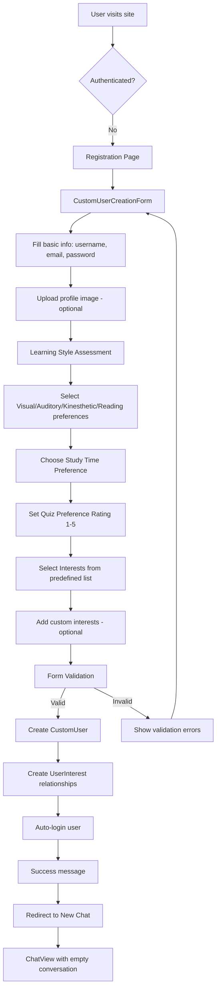

### Google OAuth Registration

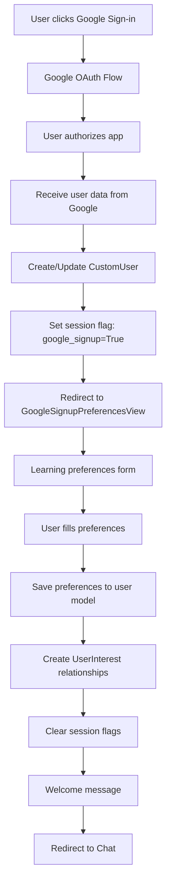

### User Preference Collection Details

The system collects the following user preferences during registration:

**Learning Styles (Boolean flags):**
- `learning_style_visual`: Visual learning preference
- `learning_style_auditory`: Auditory learning preference  
- `learning_style_kinesthetic`: Hands-on learning preference
- `learning_style_reading`: Reading/writing learning preference

**Study Preferences:**
- `preferred_study_time`: "short", "medium", or "long" sessions
- `quiz_preference`: Integer 1-5 rating of quiz helpfulness

**Interests Management:**
- Predefined subject choices (ML, AI, Web Dev, etc.)
- Custom interests via text input
- Many-to-many relationship through `UserInterest` model

## 💬 Chat Interaction Flow

### New Chat Creation

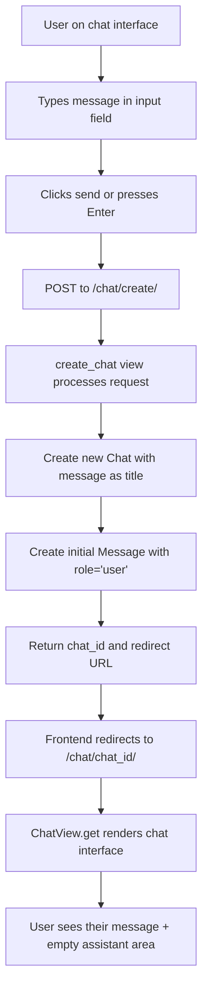

### Message Processing Flow

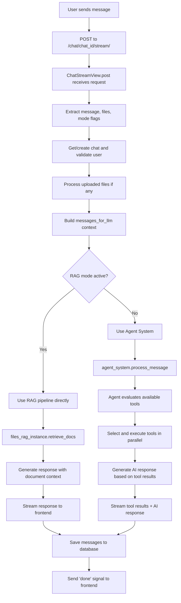

### Agent System Decision Flow

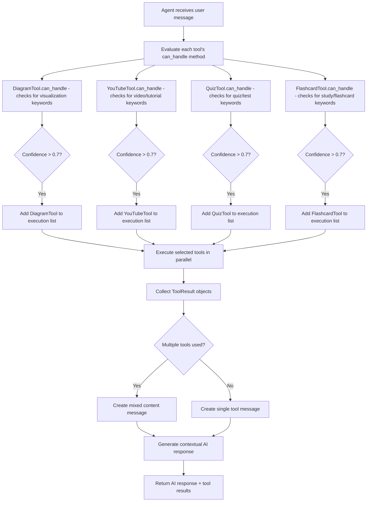

## 🛠️ Tool Usage Flows

### Diagram Generation Flow

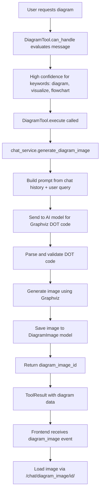

### YouTube Integration Flow

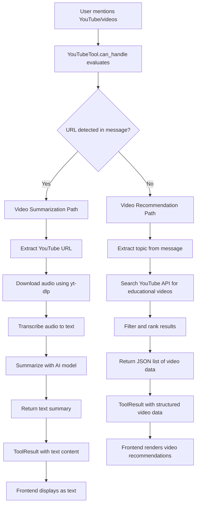

### Quiz Generation Flow

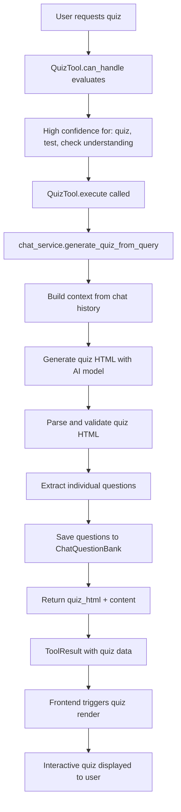

### Flashcard Generation Flow

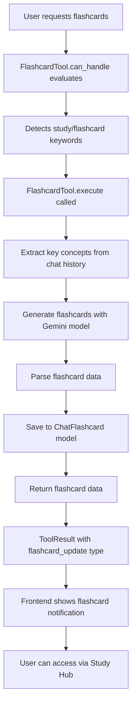

## 📁 File Management Flow

### RAG File Upload Flow

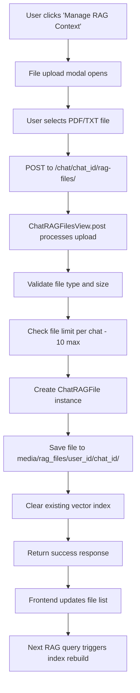

### RAG Query Processing

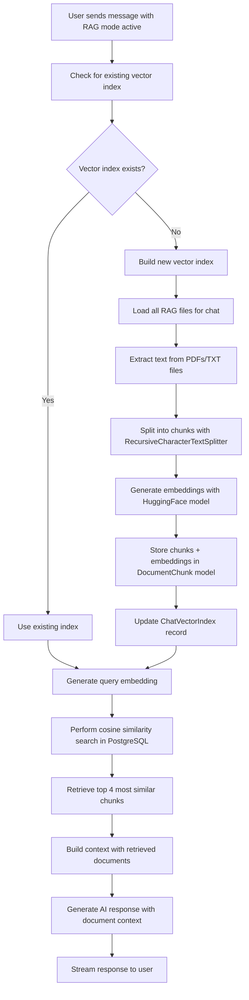

## 📚 Study Hub Flow

### Study Hub Access

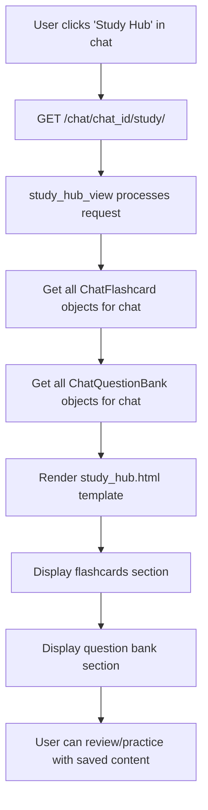

### Flashcard Review Flow

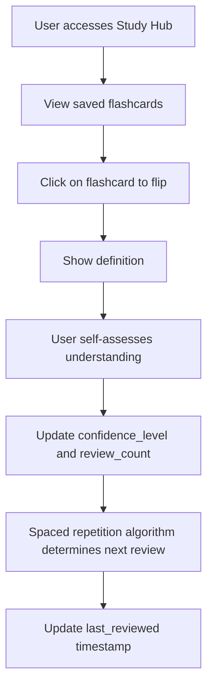

## 🔄 Mixed Content Flow

When multiple tools are triggered simultaneously:

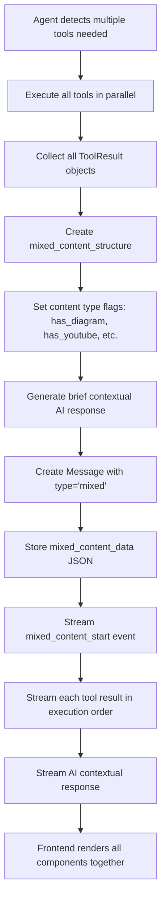

## 🔍 Error Handling Flows

### Tool Execution Errors

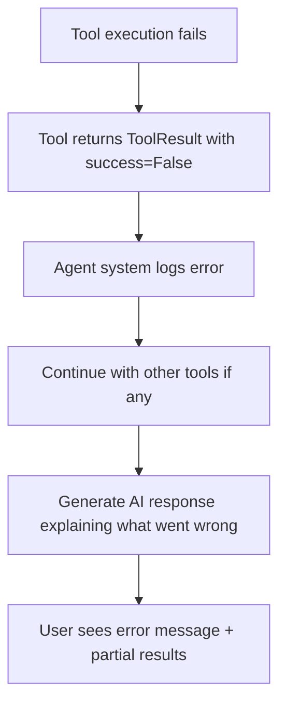

### Chat System Errors

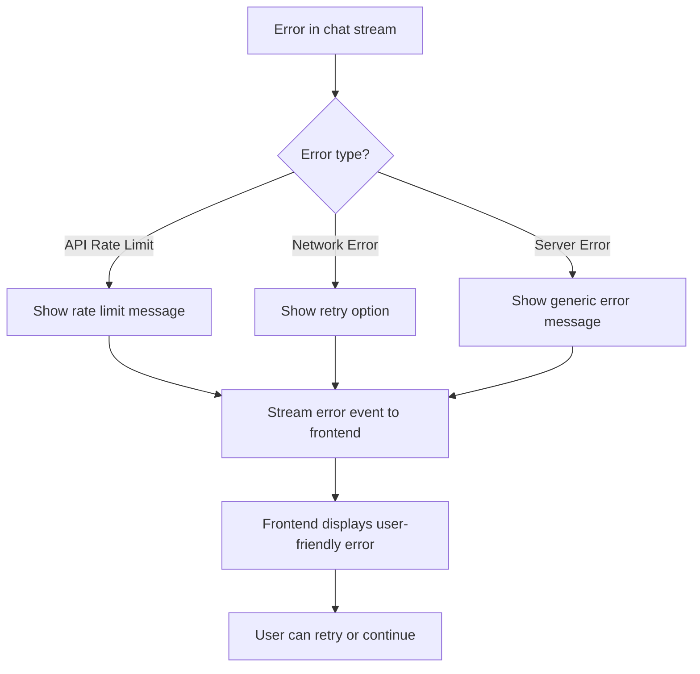

## 📊 Key User Actions Summary

| User Action | Endpoint | View/Function | Result |
|-------------|----------|---------------|---------|
| Register | `/users/register/` | `UserRegistrationView.post` | Creates user + preferences |
| Login | `/users/login/` | `LoginView` | Authenticates user |
| New Chat | `/chat/create/` | `create_chat` | Creates Chat + initial Message |
| Send Message | `/chat/{id}/stream/` | `ChatStreamView.post` | Streams AI response + tool results |
| Upload RAG File | `/chat/{id}/rag-files/` | `ChatRAGFilesView.post` | Saves file + clears vector index |
| Generate Quiz | Tool triggered by keywords | `QuizTool.execute` | Creates interactive quiz |
| Generate Diagram | Tool triggered by keywords | `DiagramTool.execute` | Creates visual diagram |
| Access Study Hub | `/chat/{id}/study/` | `study_hub_view` | Shows saved flashcards/questions |
| Edit Message | `/chat/{id}/message/{msg_id}/edit/` | `edit_message` | Updates message + deletes subsequent ones |

This documentation provides a comprehensive overview of how users interact with the MentorAI system, from initial registration through advanced features like RAG-enhanced conversations and AI tool coordination.
