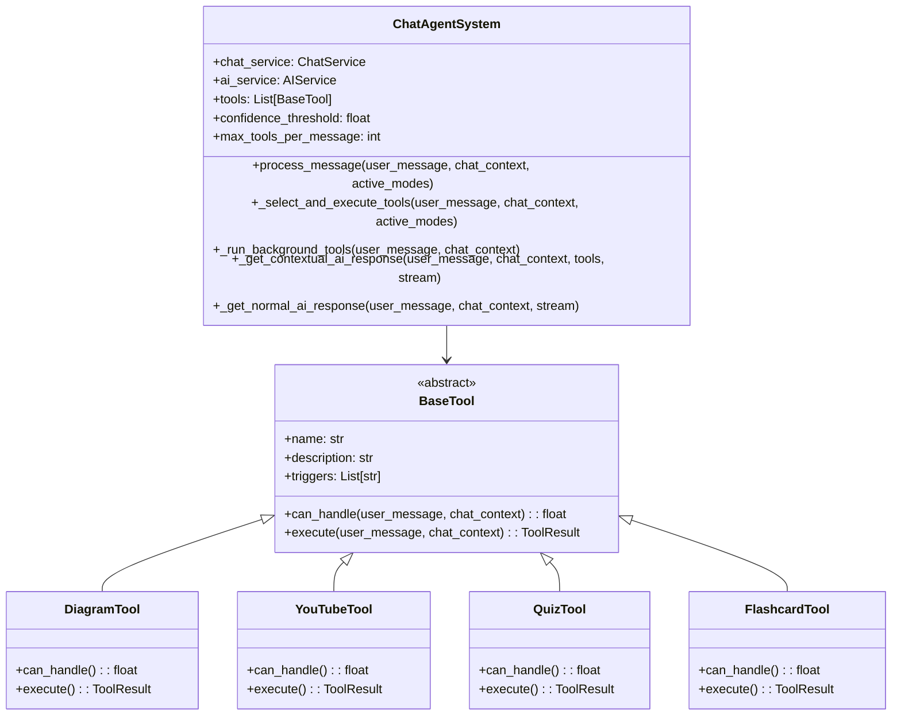
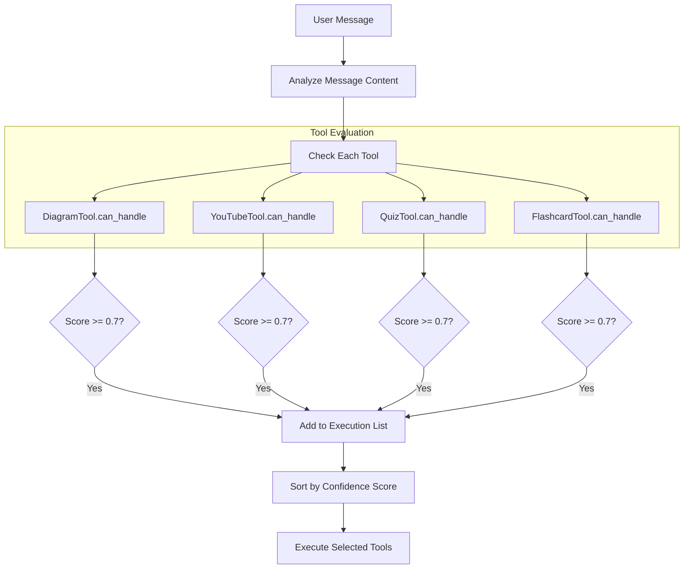
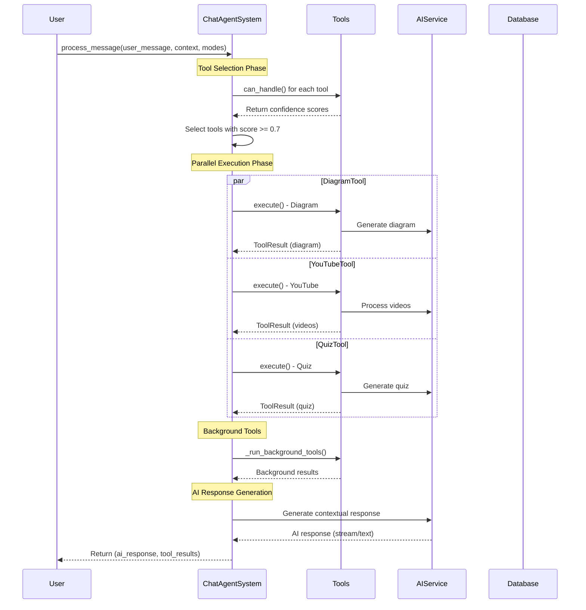
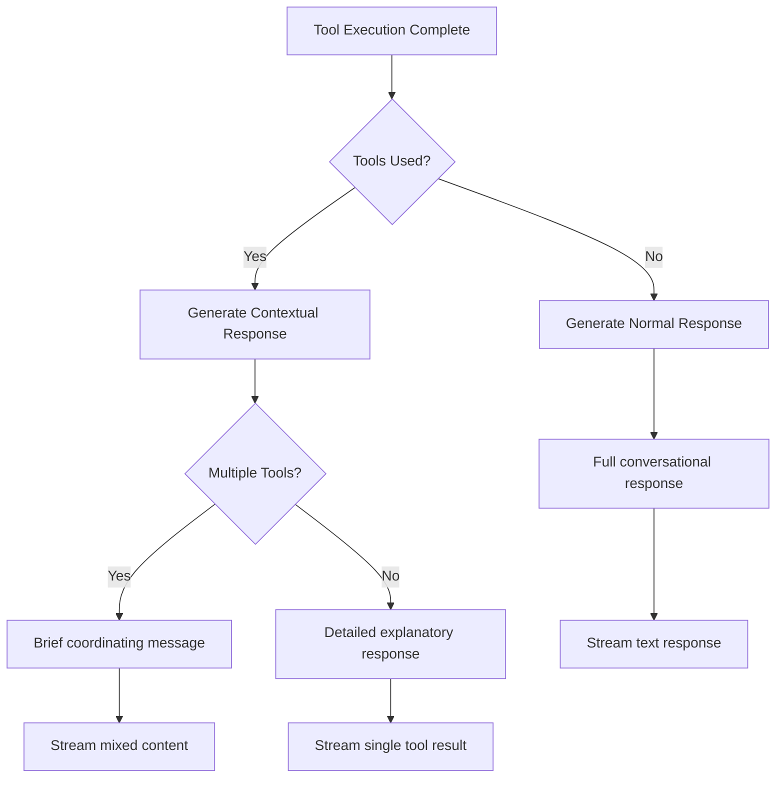
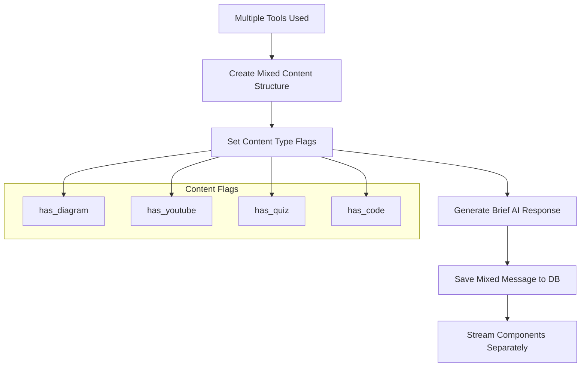
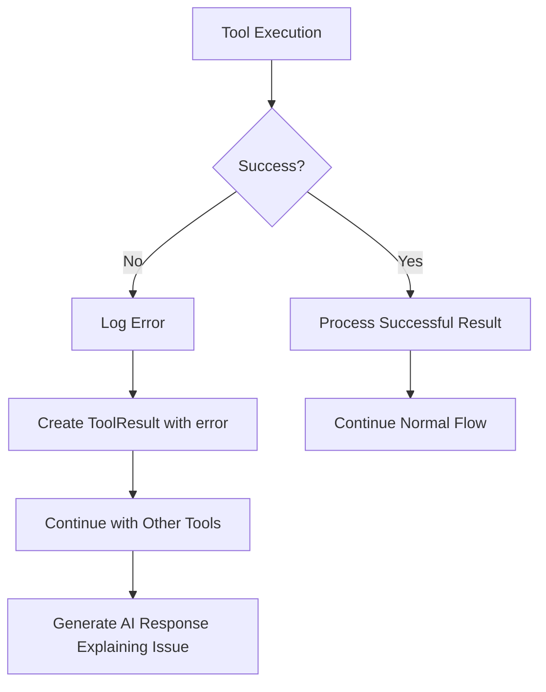

# 🤖 Agent System Documentation

The Agent System is the core intelligence layer of MentorAI that coordinates multiple AI tools and decides when and how to use them based on user messages.

## 📋 Table of Contents

1. [Overview](#overview)
2. [Architecture](#architecture)
3. [Tool Selection Algorithm](#tool-selection-algorithm)
4. [Execution Flow](#execution-flow)
5. [Tool Integration](#tool-integration)
6. [Response Generation](#response-generation)
7. [Error Handling](#error-handling)

## 🎯 Overview

The `ChatAgentSystem` acts as an intelligent coordinator that:
- Analyzes user messages to determine intent
- Selects appropriate AI tools based on confidence scores
- Executes multiple tools in parallel when beneficial
- Generates contextual AI responses
- Handles mixed content scenarios
- Manages tool failures gracefully

### Key Design Principles

1. **Parallel Execution**: Tools run simultaneously for better performance
2. **Confidence-Based Selection**: Tools self-evaluate their relevance to user queries
3. **Contextual Responses**: AI responses adapt based on which tools were used
4. **Graceful Degradation**: System continues functioning even if some tools fail
5. **Extensibility**: New tools can be easily added to the system

## 🏗️ Architecture

### Class Structure



### Tool Registration

Tools are registered during agent system initialization:

```python
class ChatAgentSystem:
    def __init__(self, chat_service, ai_service: AIService):
        self.chat_service = chat_service
        self.ai_service = ai_service
        
        # Initialize all tools
        self.tools: List[BaseTool] = [
            DiagramTool(chat_service),
            YouTubeTool(chat_service),
            QuizTool(chat_service),
            FlashcardTool(ai_service),
        ]
        
        self.confidence_threshold = 0.7  # Minimum confidence to activate a tool
        self.max_tools_per_message = 5   # Maximum tools per message
```

## 🎯 Tool Selection Algorithm

### Confidence Scoring System

Each tool implements a `can_handle()` method that returns a confidence score (0.0 - 1.0):



### Confidence Calculation Examples

#### DiagramTool Confidence Logic
```python
async def can_handle(self, user_message: str, chat_context: Dict[str, Any]) -> float:
    message_lower = user_message.lower()
    
    # High confidence patterns (0.9)
    high_confidence_patterns = [
        r"(create|make|generate|draw|show)\s+(a\s+)?(diagram|chart|flowchart)",
        r"visualize",
        r"show me (how|the process|the flow|the architecture)",
        r"explain (visually|with a diagram)",
    ]
    
    for pattern in high_confidence_patterns:
        if re.search(pattern, message_lower):
            return 0.9
    
    # Medium confidence triggers (0.6)
    if any(trigger in message_lower for trigger in self.triggers):
        return 0.6
    
    # Low confidence for complex explanations (0.3)
    if len(user_message.split()) > 10 and any(
        word in message_lower for word in ["process", "workflow", "architecture", "system"]
    ):
        return 0.3
    
    return 0.0
```

#### YouTubeTool Confidence Logic
```python
async def can_handle(self, user_message: str, chat_context: Dict[str, Any]) -> float:
    message_lower = user_message.lower()
    
    # High confidence patterns (0.9)
    high_confidence_patterns = [
        r"(find|show|recommend|suggest)\s+(me\s+)?(youtube|videos?|tutorials?)",
        r"youtube.*about",
        r"watch.*video",
        r"learn more.*video",
    ]
    
    for pattern in high_confidence_patterns:
        if re.search(pattern, message_lower):
            return 0.9
    
    # Medium confidence triggers (0.6)
    if any(trigger in message_lower for trigger in self.triggers):
        return 0.6
    
    # Learning context suggests video might be helpful (0.4)
    learning_keywords = ["learn", "tutorial", "how to", "guide", "instruction"]
    if any(keyword in message_lower for keyword in learning_keywords):
        return 0.4
    
    return 0.0
```

## ⚡ Execution Flow

### Main Process Flow



### Tool Execution Details

```python
async def _select_and_execute_tools(
    self, user_message: str, chat_context: Dict[str, Any], active_modes: Dict[str, bool]
) -> List[ToolResult]:
    """Select and execute tools based on confidence scores"""
    
    # Evaluate all tools
    tool_evaluations = []
    for tool in self.tools:
        confidence = await tool.can_handle(user_message, chat_context)
        if confidence >= self.confidence_threshold:
            tool_evaluations.append((tool, confidence))
    
    # Sort by confidence (highest first)
    tool_evaluations.sort(key=lambda x: x[1], reverse=True)
    
    # Limit number of tools
    selected_tools = tool_evaluations[:self.max_tools_per_message]
    
    # Execute tools in parallel
    if selected_tools:
        tasks = []
        for i, (tool, confidence) in enumerate(selected_tools):
            task = self._execute_tool_with_order(tool, user_message, chat_context, i)
            tasks.append(task)
        
        results = await asyncio.gather(*tasks, return_exceptions=True)
        
        # Filter out exceptions and add execution order
        valid_results = []
        for i, result in enumerate(results):
            if isinstance(result, ToolResult):
                result.execution_order = i
                valid_results.append(result)
    
    return valid_results
```

## 🔧 Tool Integration

### BaseTool Interface

All tools must implement the `BaseTool` abstract base class:

```python
class BaseTool(ABC):
    @property
    @abstractmethod
    def name(self) -> str:
        """Tool name for agent decision making"""
        pass
    
    @property
    @abstractmethod
    def description(self) -> str:
        """Description of what this tool does"""
        pass
    
    @property
    @abstractmethod
    def triggers(self) -> List[str]:
        """Keywords/phrases that might trigger this tool"""
        pass
    
    @abstractmethod
    async def can_handle(self, user_message: str, chat_context: Dict[str, Any]) -> float:
        """Return confidence score (0-1) that this tool should be used"""
        pass
    
    @abstractmethod
    async def execute(self, user_message: str, chat_context: Dict[str, Any]) -> ToolResult:
        """Execute the tool and return results"""
        pass
```

### ToolResult Structure

```python
class ToolResult(BaseModel):
    success: bool
    content: Optional[str] = None
    structured_data: Optional[Dict[str, Any]] = None
    message_type: str = "text"  # text, diagram, quiz, youtube, flashcard_update, background_process
    metadata: Optional[Dict[str, Any]] = None
    error: Optional[str] = None
    execution_order: Optional[int] = None  # Order in which tool was requested
```

### Adding New Tools

To add a new tool to the system:

1. **Create Tool Class**: Inherit from `BaseTool`
2. **Implement Required Methods**: `name`, `description`, `triggers`, `can_handle`, `execute`
3. **Register Tool**: Add to `ChatAgentSystem.__init__()` tools list
4. **Handle Results**: Update frontend to handle new message types if needed

Example new tool:

```python
class TranslationTool(BaseTool):
    @property
    def name(self) -> str:
        return "translator"
    
    @property
    def description(self) -> str:
        return "Translates text between languages"
    
    @property
    def triggers(self) -> List[str]:
        return ["translate", "translation", "language", "español", "français"]
    
    async def can_handle(self, user_message: str, chat_context: Dict[str, Any]) -> float:
        if "translate" in user_message.lower():
            return 0.9
        return 0.0
    
    async def execute(self, user_message: str, chat_context: Dict[str, Any]) -> ToolResult:
        # Implementation here
        pass
```

## 🎨 Response Generation

### Contextual AI Responses

The agent system generates different types of AI responses based on tool usage:



### Response Types

#### 1. Contextual Response (Tools Used)
```python
async def _get_contextual_ai_response(
    self, user_message: str, chat_context: Dict[str, Any], 
    successful_tools: List[ToolResult], stream: bool = False
) -> Optional[str]:
    """Generate AI response that contextualizes tool results"""
    
    tool_names = [tool.message_type for tool in successful_tools]
    
    if len(successful_tools) > 1:
        # Brief message for multiple tools
        prompt = f"""The user asked: "{user_message}"
        
        I've generated multiple resources for you: {', '.join(tool_names)}.
        Provide a brief (1-2 sentences) contextual message explaining how these resources address their request."""
    else:
        # More detailed message for single tool
        tool_result = successful_tools[0]
        prompt = f"""The user asked: "{user_message}"
        
        I've created a {tool_result.message_type} for you. 
        Provide a helpful explanation (2-3 sentences) about what was created and how it addresses their request."""
    
    if stream:
        return await self.ai_service.stream_completion([{"role": "user", "content": prompt}])
    else:
        return await self.ai_service.get_completion([{"role": "user", "content": prompt}])
```

#### 2. Normal Response (No Tools)
```python
async def _get_normal_ai_response(
    self, user_message: str, chat_context: Dict[str, Any], stream: bool = False
) -> Optional[str]:
    """Generate normal conversational AI response"""
    
    messages = chat_context.get("messages_for_llm", [])
    messages.append({"role": "user", "content": user_message})
    
    if stream:
        return await self.ai_service.stream_completion(messages)
    else:
        return await self.ai_service.get_completion(messages)
```

### Mixed Content Handling

When multiple tools are used, the system creates a special "mixed content" message:



## 🛡️ Error Handling

### Tool Execution Errors



### Error Recovery Strategies

1. **Individual Tool Failures**: System continues with other tools
2. **Partial Failures**: Users see successful results + error notifications
3. **Complete Failures**: Fallback to normal AI conversation
4. **API Rate Limits**: Graceful degradation with user notification
5. **Network Issues**: Retry logic with exponential backoff

### Error Logging

```python
async def _execute_tool_with_order(
    self, tool: BaseTool, user_message: str, chat_context: Dict[str, Any], order: int
) -> ToolResult:
    """Execute a single tool with error handling"""
    try:
        result = await tool.execute(user_message, chat_context)
        result.execution_order = order
        
        if result.success:
            logger.info(f"Tool {tool.name} executed successfully (order: {order})")
        else:
            logger.warning(f"Tool {tool.name} failed: {result.error} (order: {order})")
        
        return result
    except Exception as e:
        logger.error(f"Exception in tool {tool.name}: {e}", exc_info=True)
        return ToolResult(
            success=False,
            error=f"Tool execution failed: {str(e)}",
            message_type="error",
            execution_order=order
        )
```

## 📊 Performance Considerations

### Optimization Strategies

1. **Parallel Tool Execution**: All selected tools run simultaneously
2. **Confidence Threshold**: Prevents low-relevance tools from executing
3. **Tool Limit**: Maximum 5 tools per message to prevent overload
4. **Streaming Responses**: Better user experience for long-running operations
5. **Caching**: Tool results cached when appropriate
6. **Background Processing**: Non-critical tools run in background

### Monitoring & Metrics

- Tool selection accuracy rates
- Average response times per tool
- Error rates by tool type
- User satisfaction with tool suggestions
- Resource utilization during parallel execution

The Agent System represents the core innovation of MentorAI, enabling intelligent coordination of multiple AI capabilities to provide comprehensive, contextual responses to user queries.
