# 📊 Diagram Tool Documentation

The DiagramTool is responsible for generating visual diagrams to help explain complex concepts, processes, and relationships in response to user queries.

## 📋 Table of Contents

1. [Overview](#overview)
2. [Activation Logic](#activation-logic)
3. [Diagram Generation Process](#diagram-generation-process)
4. [Supported Diagram Types](#supported-diagram-types)
5. [Integration with Agent System](#integration-with-agent-system)
6. [Error Handling](#error-handling)
7. [Examples](#examples)

## 🎯 Overview

The DiagramTool automatically creates visual representations when users request diagrams or when complex topics would benefit from visualization. It uses Graphviz to generate professional-quality diagrams from AI-generated DOT language code.

### Key Features

- **Automatic Trigger Detection**: Recognizes when users want visual explanations
- **Context-Aware Generation**: Creates diagrams based on conversation history
- **Multiple Diagram Types**: Supports flowcharts, architectures, processes, and more
- **High-Quality Output**: Uses Graphviz for professional diagram rendering
- **Database Storage**: Diagrams are stored and served efficiently

### Technical Stack

- **AI Model**: Groq API for DOT code generation
- **Rendering Engine**: Graphviz (dot command)
- **Storage**: PostgreSQL with binary data storage
- **Serving**: Custom Django view for image delivery

## 🎯 Activation Logic

### Confidence Scoring Algorithm

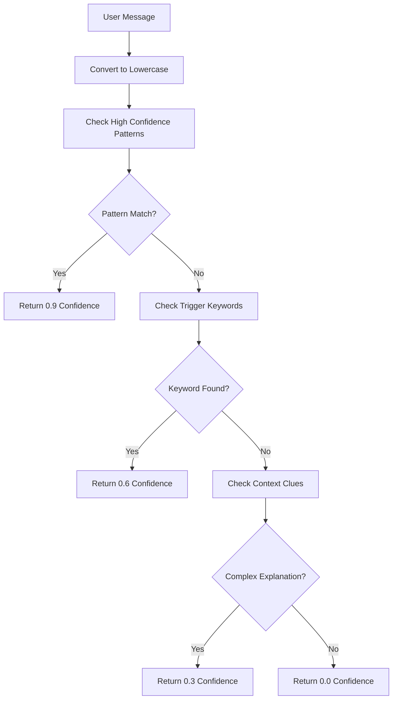

### High Confidence Patterns (0.9)

```python
high_confidence_patterns = [
    r"(create|make|generate|draw|show)\s+(a\s+)?(diagram|chart|flowchart)",
    r"visualize",
    r"show me (how|the process|the flow|the architecture)",
    r"explain (visually|with a diagram)",
]
```

**Examples that trigger high confidence:**
- "Create a diagram showing the process"
- "Can you visualize this for me?"
- "Show me how this works"
- "Draw a flowchart of the algorithm"
- "Explain this visually"

### Medium Confidence Keywords (0.6)

```python
triggers = [
    "diagram", "chart", "visualize", "draw", "flowchart",
    "architecture", "process flow", "explain visually", "visual representation"
]
```

**Examples that trigger medium confidence:**
- "I need a flowchart"
- "What's the architecture like?"
- "Can you draw this?"

### Low Confidence Context (0.3)

For messages longer than 10 words containing process-related terms:
- "process", "workflow", "architecture", "system"

**Examples that trigger low confidence:**
- "Explain the entire software development process from start to finish"
- "How does the authentication system architecture work in detail?"

## 🔄 Diagram Generation Process

### End-to-End Flow

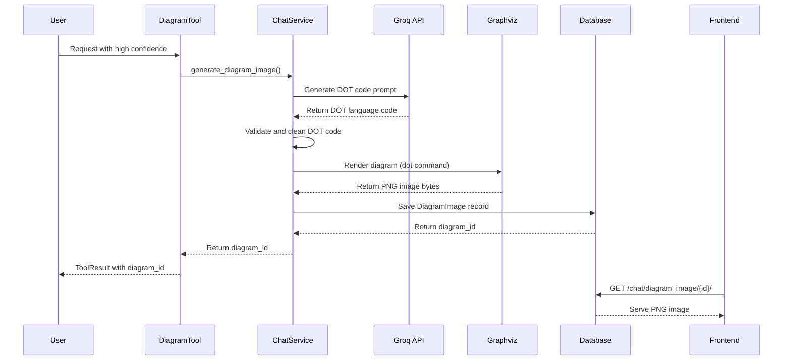

### Detailed Implementation

#### 1. Prompt Construction
```python
def build_diagram_prompt(chat_history, user_query):
    context = extract_relevant_context(chat_history)
    
    prompt = f"""Based on this conversation context and user query, generate a Graphviz DOT language diagram.

Context: {context}
User Query: {user_query}

Create a clear, well-structured diagram using DOT syntax. Include:
- Proper node and edge definitions
- Clear labels and relationships
- Appropriate layout (digraph, graph, etc.)
- Professional styling

Return only the DOT code, no explanations."""
    
    return prompt
```

#### 2. DOT Code Generation
The tool sends the constructed prompt to Groq API and receives DOT language code:

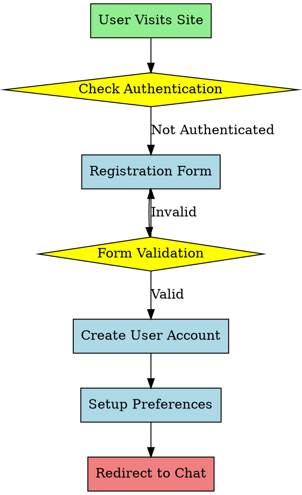

#### 3. Image Rendering
```python
async def render_diagram(dot_code: str) -> bytes:
    """Render DOT code to PNG using Graphviz"""
    try:
        # Save DOT code to temporary file
        with tempfile.NamedTemporaryFile(mode='w', suffix='.dot', delete=False) as f:
            f.write(dot_code)
            dot_file_path = f.name
        
        # Generate PNG using Graphviz
        png_file_path = dot_file_path.replace('.dot', '.png')
        subprocess.run([
            'dot', '-Tpng', dot_file_path, '-o', png_file_path
        ], check=True)
        
        # Read generated PNG
        with open(png_file_path, 'rb') as f:
            image_bytes = f.read()
        
        # Cleanup temporary files
        os.unlink(dot_file_path)
        os.unlink(png_file_path)
        
        return image_bytes
        
    except subprocess.CalledProcessError as e:
        raise DiagramGenerationError(f"Graphviz rendering failed: {e}")
```

#### 4. Database Storage
```python
# Create DiagramImage record
diagram_image = DiagramImage.objects.create(
    chat=chat,
    user=user,
    image_data=image_bytes,
    filename=f"diagram_{uuid.uuid4().hex[:8]}.png",
    content_type="image/png"
)

return diagram_image.id
```

## 📊 Supported Diagram Types

### 1. Flowcharts
**Use Case**: Process flows, decision trees, algorithms
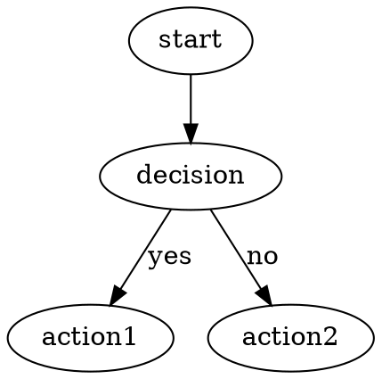

### 2. System Architecture
**Use Case**: Software architecture, network diagrams
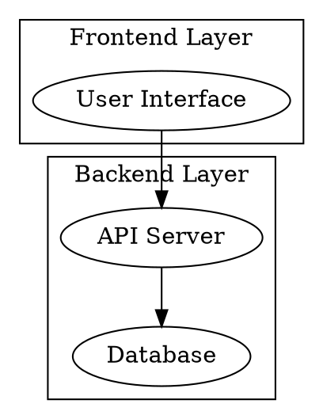

### 3. Entity Relationships
**Use Case**: Database schemas, object relationships
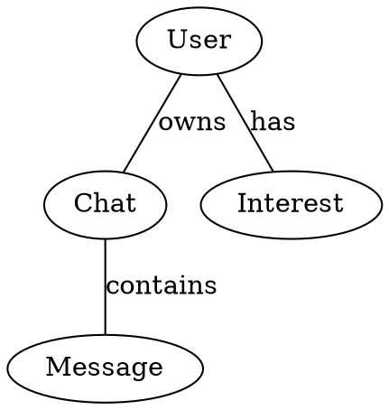

### 4. Mind Maps
**Use Case**: Concept relationships, learning topics
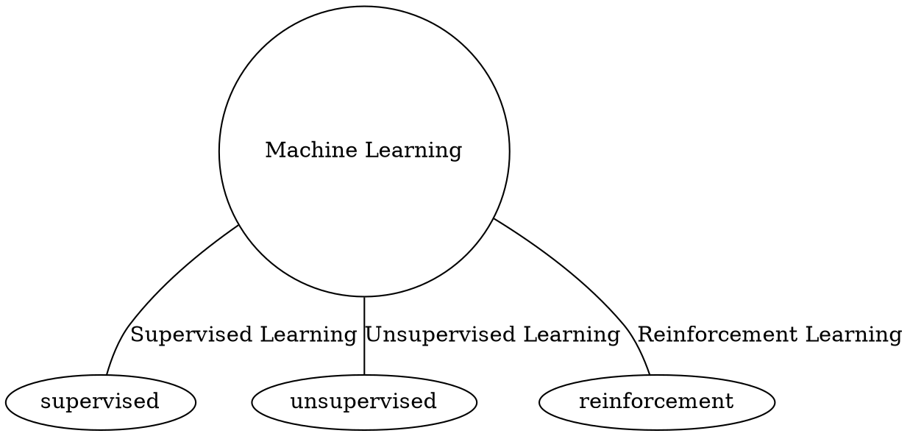

### 5. Timeline Diagrams
**Use Case**: Project timelines, historical events
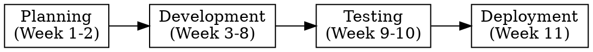

## 🤝 Integration with Agent System

### Tool Registration
```python
class ChatAgentSystem:
    def __init__(self, chat_service, ai_service):
        self.tools = [
            DiagramTool(chat_service),  # Registered here
            # ... other tools
        ]
```

### Execution in Agent Context
```python
async def execute(self, user_message: str, chat_context: Dict[str, Any]) -> ToolResult:
    try:
        diagram_id = await self.chat_service.generate_diagram_image(
            chat_history_messages=chat_context.get("messages_for_llm", []),
            user_query=user_message,
            chat_id=chat_context["chat"].id,
            user_id=chat_context["user"].id,
        )
        
        if diagram_id:
            return ToolResult(
                success=True,
                content=f"Diagram generated for: {user_message[:100]}",
                message_type="diagram",
                structured_data={"diagram_image_id": str(diagram_id)},
                metadata={"tool_used": "diagram_generator"},
            )
        else:
            return ToolResult(success=False, error="Failed to generate diagram")
            
    except Exception as e:
        logger.error(f"DiagramTool error: {e}", exc_info=True)
        return ToolResult(success=False, error=f"Diagram generation error: {str(e)}")
```

### Frontend Integration
```javascript
// Handle diagram events from server-sent events
if (data.type === 'diagram_image') {
    const diagramId = data.diagram_image_id;
    const imageUrl = `/chat/diagram_image/${diagramId}/`;
    
    // Create image element
    const img = document.createElement('img');
    img.src = imageUrl;
    img.className = 'diagram-image max-w-full h-auto rounded-lg shadow-lg';
    img.alt = 'Generated diagram';
    
    // Add to chat interface
    messageContainer.appendChild(img);
}
```

## 🛡️ Error Handling

### Common Error Scenarios

#### 1. Invalid DOT Code
```python
def validate_dot_code(dot_code: str) -> bool:
    """Basic validation of DOT syntax"""
    if not dot_code.strip():
        return False
    
    # Check for basic DOT structure
    has_graph_declaration = bool(re.search(r'(di)?graph\s+\w+\s*{', dot_code))
    has_closing_brace = '}' in dot_code
    
    return has_graph_declaration and has_closing_brace
```

#### 2. Graphviz Rendering Errors
```python
try:
    subprocess.run(['dot', '-Tpng', dot_file, '-o', png_file], check=True)
except subprocess.CalledProcessError as e:
    logger.error(f"Graphviz rendering failed: {e}")
    # Fallback: Try with simpler layout engine
    subprocess.run(['neato', '-Tpng', dot_file, '-o', png_file], check=True)
```

#### 3. File System Errors
```python
def ensure_temp_directory():
    """Ensure temporary directory exists and is writable"""
    temp_dir = '/tmp/diagrams'
    os.makedirs(temp_dir, exist_ok=True)
    
    if not os.access(temp_dir, os.W_OK):
        raise PermissionError(f"Cannot write to {temp_dir}")
```

#### 4. Database Storage Errors
```python
try:
    diagram_image = DiagramImage.objects.create(...)
except IntegrityError as e:
    logger.error(f"Database constraint violation: {e}")
    return None
except Exception as e:
    logger.error(f"Unexpected database error: {e}")
    return None
```

### Error Recovery Strategies

1. **DOT Code Cleanup**: Remove problematic syntax elements
2. **Alternative Layout Engines**: Try different Graphviz engines (dot, neato, circo)
3. **Simplified Diagrams**: Generate basic diagrams if complex ones fail
4. **Graceful Degradation**: Return text description if diagram generation fails

## 📝 Examples

### Example 1: Process Flow Request

**User Input:**
> "Show me the user registration process flow"

**Generated DOT Code:**
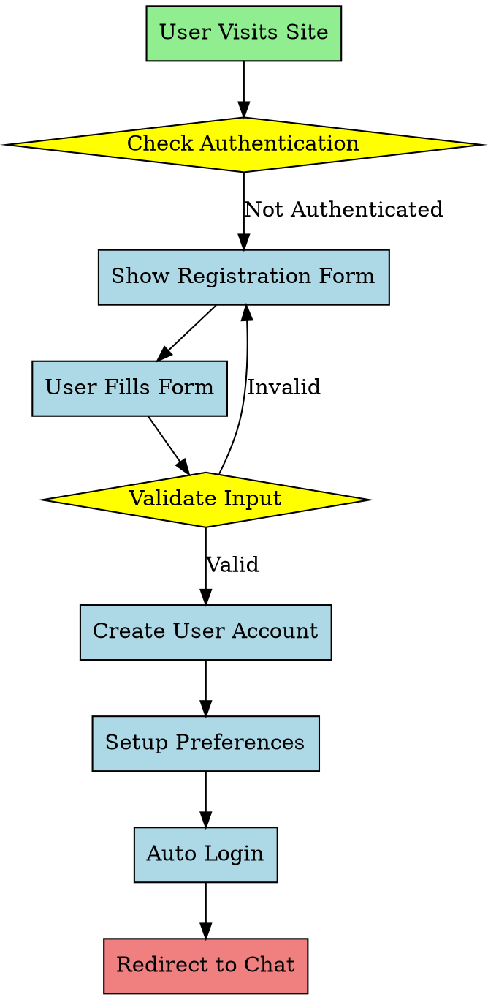

### Example 2: System Architecture Request

**User Input:**
> "Visualize the MentorAI system architecture"

**Generated DOT Code:**
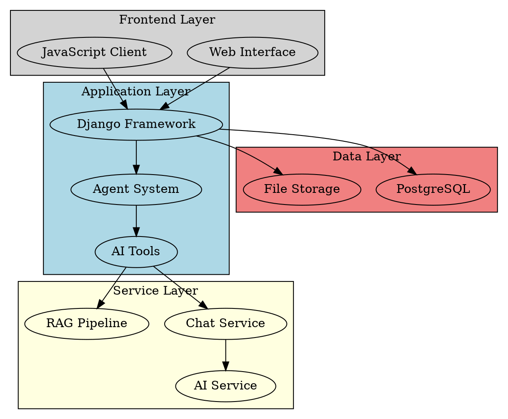

### Example 3: Learning Concept Map

**User Input:**
> "Create a diagram showing machine learning concepts"

**Generated DOT Code:**
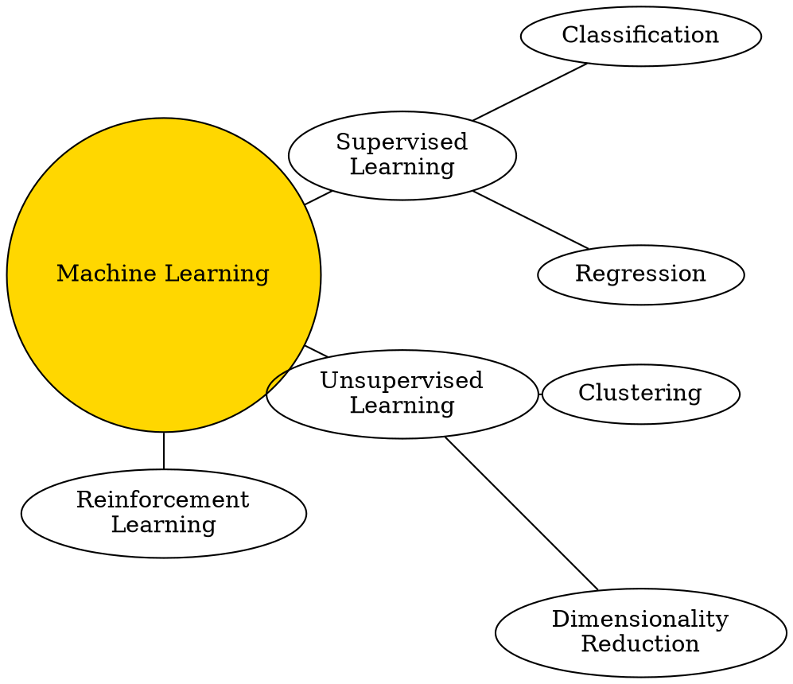

The DiagramTool provides a powerful way to enhance learning through visual representation, automatically detecting when diagrams would be helpful and generating appropriate visualizations based on the conversation context.
